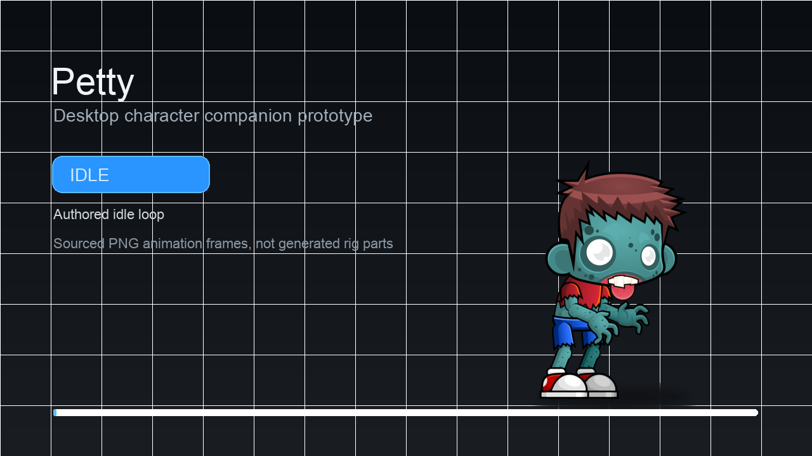
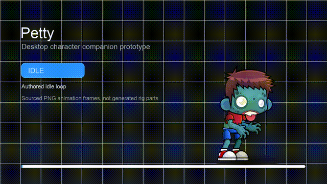
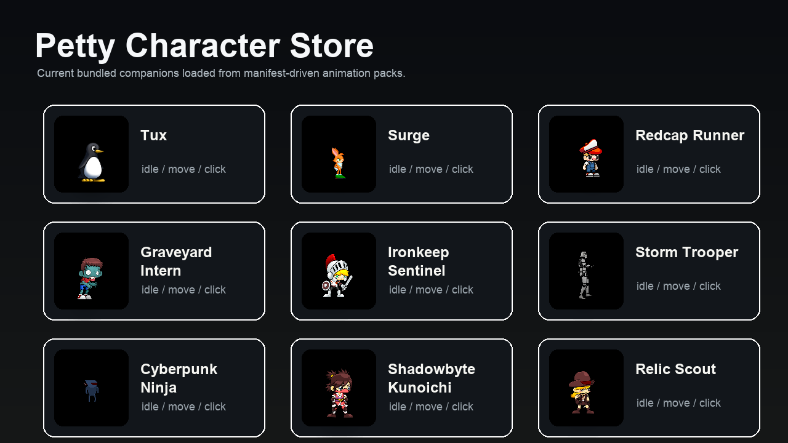
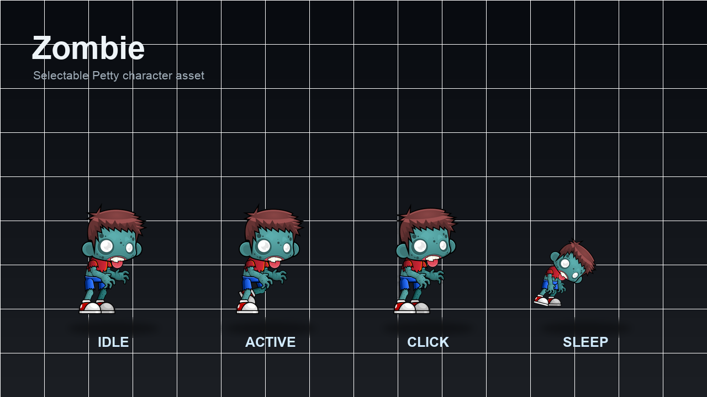
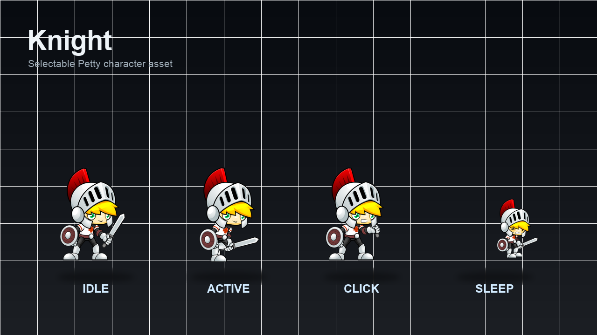
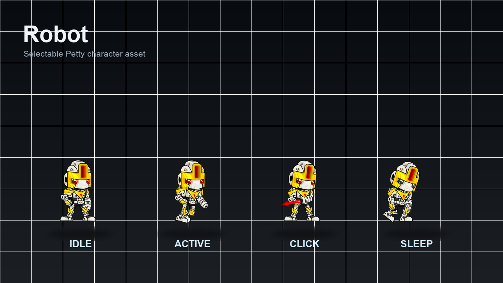
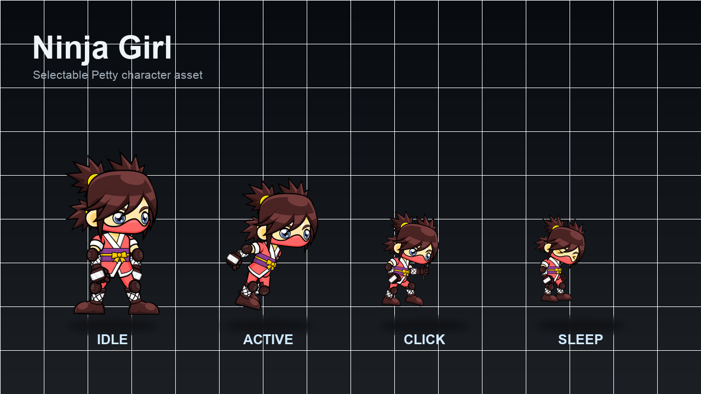
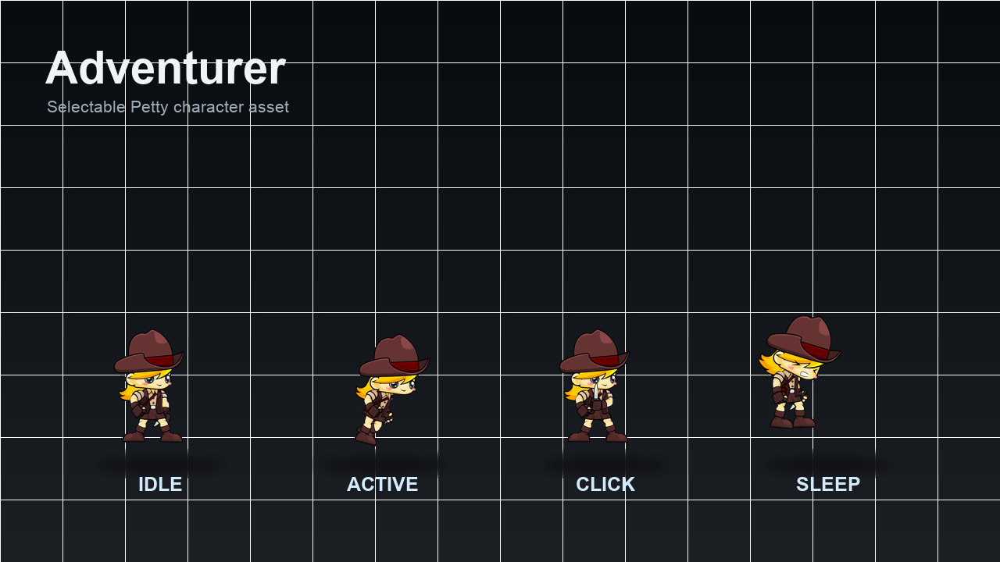

# Petty

Petty is a native macOS prototype for a tiny animated desktop companion. The current prototype uses sourced 2D character sprite assets with authored frame animations.

## Demo





- [X-ready edited MP4 demo with character transitions](docs/media/petty-x-demo.mp4)
- [Full-size MP4 asset transition demo](docs/media/petty-assets-demo.mp4)
- [Raw live desktop recording](docs/media/petty-live-recording.mov)
- [Live desktop screenshot](docs/media/petty-live-desktop.png)

## Character Assets



The bundled store now includes recognizable free-culture characters from official open-source game projects:

- Tux from SuperTux.
- Surge from Open Surge.
- Santa Claus, Dino, and Red Hat Boy from OpenGameArt/GameArt2D CC0 packs.

It also includes the earlier GameArt2D/OpenGameArt packs:

| Zombie | Knight | Robot |
| --- | --- | --- |
|  |  |  |

| Ninja Girl | Adventurer |
| --- | --- |
|  |  |

## Current Prototype Features

- Transparent, borderless character window.
- Floating always-on-top mode.
- Menu bar controls for show, hide, reset position, always-on-top, and quit.
- Store & Settings window with bundled SuperTux, Open Surge, GameArt2D, and OpenGameArt character assets.
- Drop-in bundled character packs loaded from per-character manifests.
- Drag-to-move behavior.
- Drag-speed-reactive animation playback.
- Authored PNG sequence rendering for idle, walk/run, attack, and sleepy/dead states.
- Saved and restored character position.
- Basic states: idle, active, bored, and dragging.
- Privacy-safe activity detection using system idle time plus keyboard/pointer event timing.

## How To Run Locally

Open the project in Xcode:

```sh
open Petty/Petty.xcodeproj
```

Then select the `Petty` scheme and run the macOS app.

Or use the project run script:

```sh
./script/build_and_run.sh
```

## Adding Character Packs

Petty now discovers bundled character folders from `Petty/Petty/Resources/Characters`. Add a folder with PNG sequence frames, `ATTRIBUTION.md`, and `manifest.json`; the app loads it into the Store & Settings character picker automatically on next build.

See [docs/ASSET_PACKS.md](docs/ASSET_PACKS.md) for the expected folder layout and manifest schema.

See [docs/ASSET_RESEARCH.md](docs/ASSET_RESEARCH.md) for the official-source asset research notes.

## Current Limitations

- The current character is an authored PNG sequence asset, not a skeletal Rive/Spine rig.
- Rive is integrated as an optional future runtime path, but the current desktop pet uses PNG frame animation.
- No remote marketplace, backend, accounts, payments, telemetry, AI chat, or cloud sync.
- Fullscreen and Spaces behavior may vary by macOS version and user window settings.
- Activity detection does not inspect typed text or app content.

## Next Steps

- Add a true skeletal asset pack, such as Rive or Spine, when a production-ready rig is available.
- Add a minimal settings window for opacity, visibility mode, and size.
- Add smarter visibility modes such as Desktop Only, Focus Mode, and Pause During Fullscreen.
- Add a character data model for future collectible packs.
- Package the app for easier local testing.
