# Petty

[](https://github.com/Saba-Burduli/Petty/actions/workflows/build.yml)
[](https://www.apple.com/macos/)
[](https://www.swift.org/)
[](LICENSE)

Petty is an open-source, native macOS desktop companion. It places animated 2D characters in a transparent floating window that reacts to activity, dragging, clicking, and idle time.

> [!IMPORTANT]
> Petty is an early-stage prototype. It is not currently distributed as a signed or notarized release. The source code is MIT-licensed, while bundled character assets retain their own upstream licenses. See [Third-Party Notices](THIRD_PARTY_NOTICES.md).

## Requirements

- macOS 14 Sonoma or newer.
- Xcode with the macOS 14 SDK or newer.
- Git for cloning the repository.

## Quick Start

```sh
git clone https://github.com/Saba-Burduli/Petty.git
cd Petty
./script/build_and_run.sh
```

The first build resolves the pinned Rive runtime package through Swift Package Manager. You can also open `Petty/Petty.xcodeproj`, select the `Petty` scheme, and run the app from Xcode.

## Desktop Showcase

Choose a companion, place it anywhere on the desktop, resize it, and access visibility or position controls from the Mac menu bar.

| Menu Bar Controls | Character Store |
| --- | --- |
| 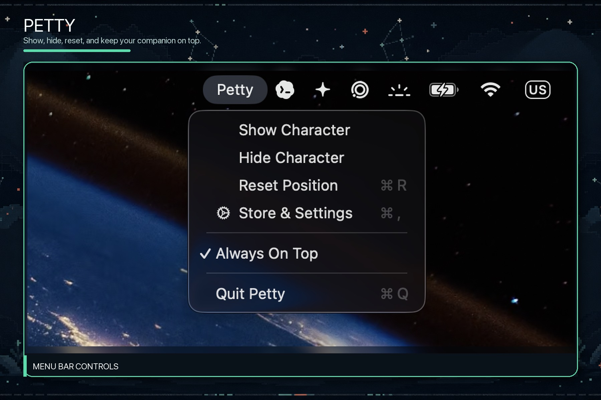 | 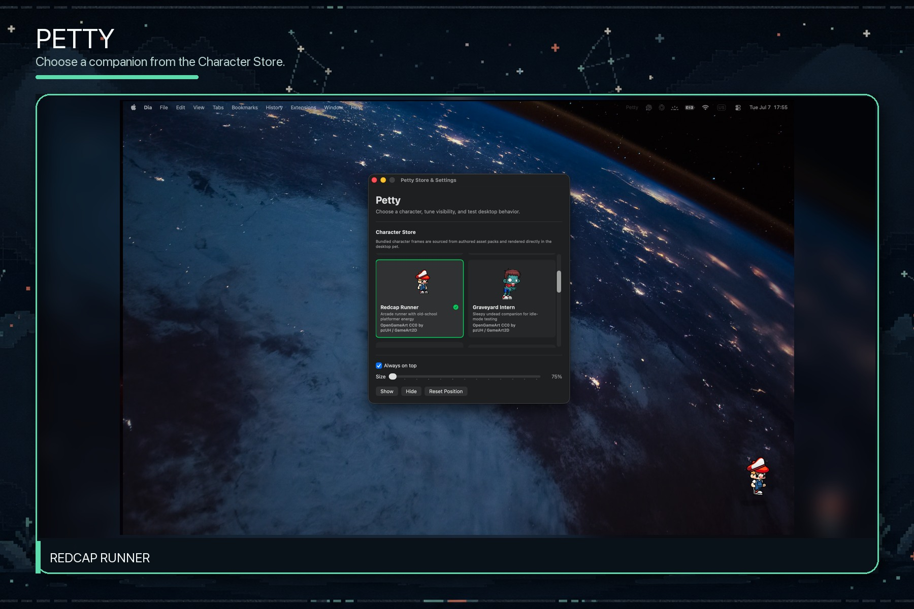 |

| Tux | Surge |
| --- | --- |
| 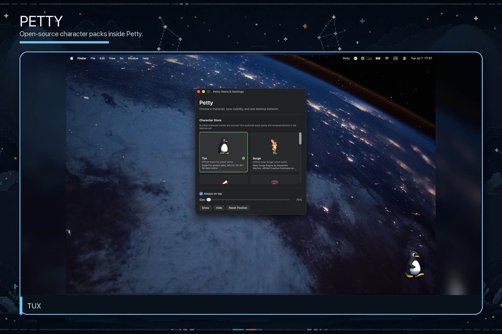 | 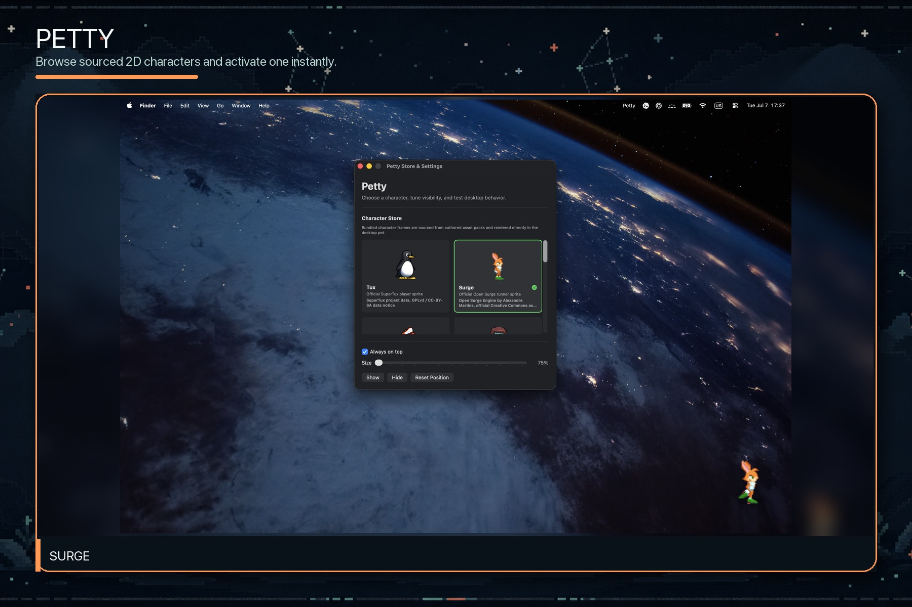 |

| Graveyard Intern | Cyberpunk Ninja |
| --- | --- |
| 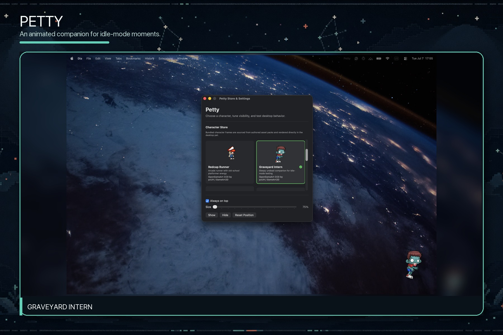 | 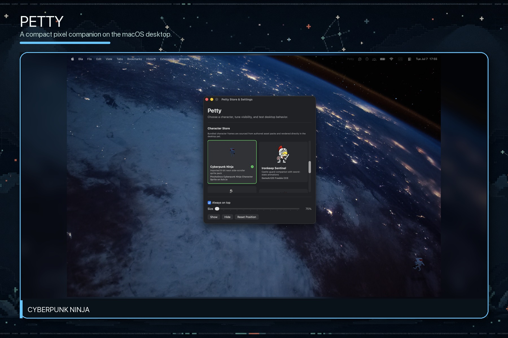 |

| Ironkeep Sentinel | Storm Trooper |
| --- | --- |
| 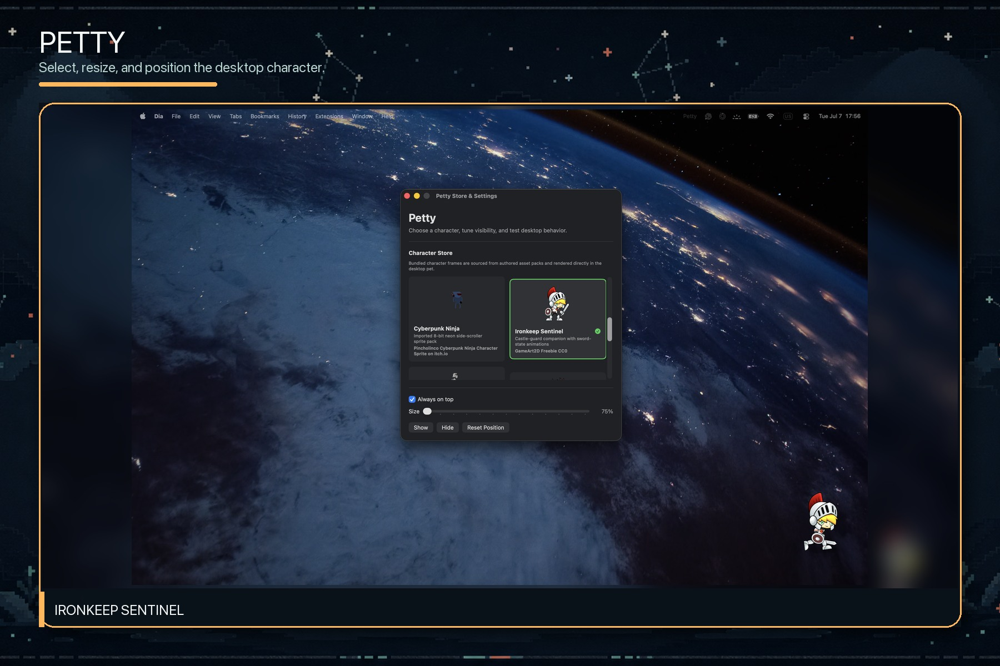 | 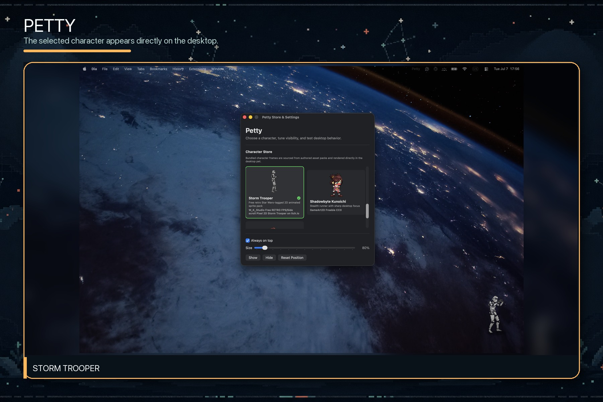 |

| Shadowbyte Kunoichi | Relic Scout |
| --- | --- |
|  | 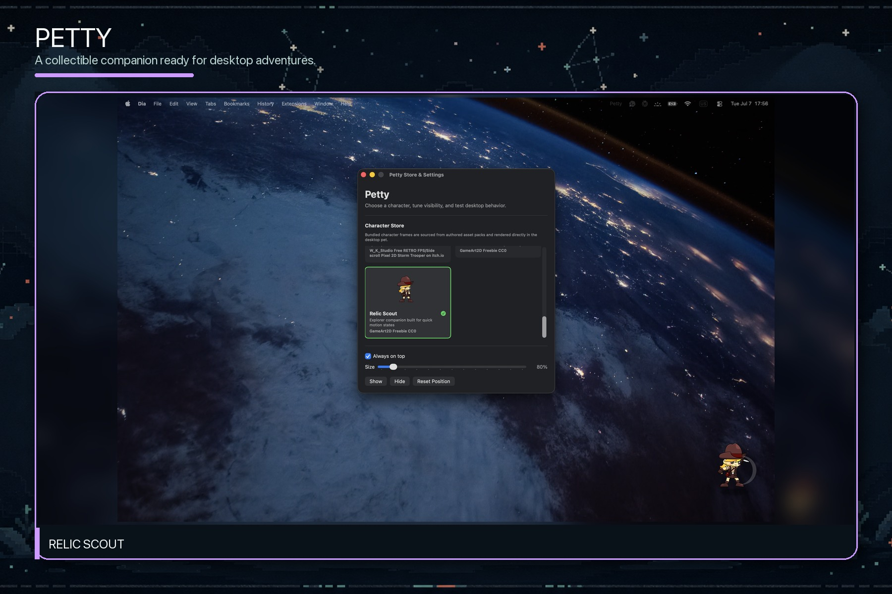 |

## Trailer

[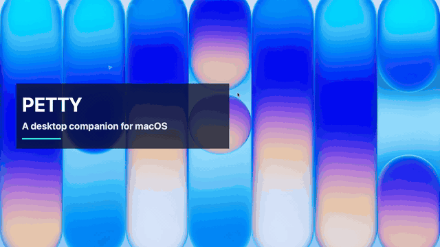](docs/media/trailers/petty-launch-trailer-30s.mp4)

## Character Assets


The bundled store now includes sourced character packs from open game projects, free asset stores, and itch.io:

- Tux from SuperTux.
- Surge from Open Surge.
- Storm Trooper from W_K_Studio's CC0 itch.io sprite pack.
- Redcap Runner from an OpenGameArt/GameArt2D CC0 pack.
- Cyberpunk Ninja from Pincholinco's CC BY 4.0 itch.io sprite pack.
- Graveyard Intern from an OpenGameArt/GameArt2D CC0 pack.
- Ironkeep Sentinel from a GameArt2D CC0 pack.
- Shadowbyte Kunoichi from a GameArt2D CC0 pack.
- Relic Scout from a GameArt2D CC0 pack.

It also includes the earlier GameArt2D/OpenGameArt packs that remain in the store:

| Graveyard Intern | Ironkeep Sentinel | Storm Trooper |
| --- | --- | --- |
|  |  | 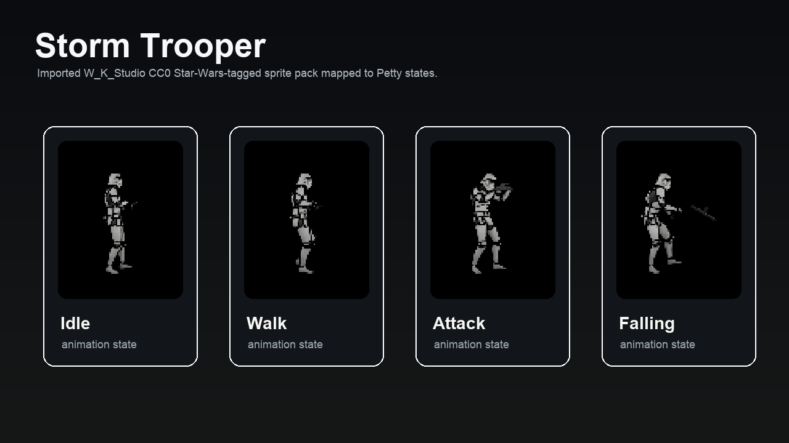 |

| Shadowbyte Kunoichi | Relic Scout |
| --- | --- |
|  |  |

## Features

- Transparent, borderless character window.
- Floating always-on-top mode.
- Menu bar controls for show, hide, reset position, always-on-top, and quit.
- Store & Settings window with bundled SuperTux, Open Surge, GameArt2D, and OpenGameArt character assets.
- Drop-in bundled character packs loaded from per-character manifests.
- Drag-to-move behavior.
- Drag-speed-reactive animation playback.
- Authored PNG sequence rendering for idle, walk/run, attack, and sleepy/dead states.
- Saved and restored character position.
- Basic states: idle, active, bored, and dragging.
- Privacy-safe activity detection using system idle time plus keyboard/pointer event timing.

## Architecture

- SwiftUI provides the settings interface and character rendering.
- AppKit manages the transparent borderless window, menu bar controls, desktop placement, and input behavior.
- Character packs are discovered from per-character `manifest.json` files.
- `UserDefaults` stores local character selection, position, size, and visibility preferences.
- Privacy-safe activity detection uses system idle timing and does not inspect typed text or app content.

See [Project Plan](docs/PROJECT_PLAN.md) for the component map and current technical scope.

## Adding Character Packs

Petty now discovers bundled character folders from `Petty/Petty/Resources/Characters`. Add a folder with PNG sequence frames, `ATTRIBUTION.md`, and `manifest.json`; the app loads it into the Store & Settings character picker automatically on next build.

See [docs/ASSET_PACKS.md](docs/ASSET_PACKS.md) for the expected folder layout and manifest schema.

See [docs/ASSET_RESEARCH.md](docs/ASSET_RESEARCH.md) for the official-source asset research notes.

New bundled assets must have a clear redistribution license, complete attribution, and authored animation frames. Do not submit copied commercial game, film, or anime characters.

## Current Limitations

- The current character is an authored PNG sequence asset, not a skeletal Rive/Spine rig.
- Rive is integrated as an optional future runtime path, but the current desktop pet uses PNG frame animation.
- No remote marketplace, backend, accounts, payments, telemetry, AI chat, or cloud sync.
- Fullscreen and Spaces behavior may vary by macOS version and user window settings.
- Activity detection does not inspect typed text or app content.

## Next Steps

- Add a true skeletal asset pack, such as Rive or Spine, when a production-ready rig is available.
- Add a minimal settings window for opacity, visibility mode, and size.
- Add smarter visibility modes such as Desktop Only, Focus Mode, and Pause During Fullscreen.
- Add a character data model for future collectible packs.
- Package the app for easier local testing.

## Contributing

Contributions are welcome. Read [CONTRIBUTING.md](CONTRIBUTING.md) before opening an issue or pull request. Development changes target `dev`; reviewed releases are merged into `master`.

Please use [GitHub Issues](https://github.com/Saba-Burduli/Petty/issues) for reproducible bugs and focused feature proposals. Security reports should follow [SECURITY.md](SECURITY.md).

## License

Petty's original source code is available under the [MIT License](LICENSE). Bundled characters, media, and third-party dependencies are not relicensed by Petty; their individual terms and source links are documented in [THIRD_PARTY_NOTICES.md](THIRD_PARTY_NOTICES.md) and each character pack's `ATTRIBUTION.md`.
